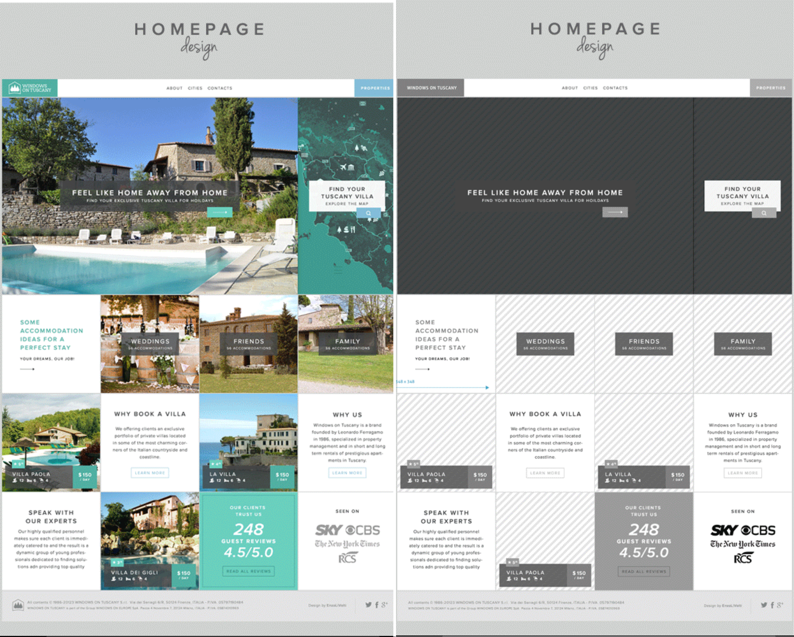
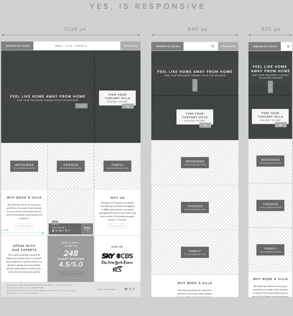

# Tuscany Villa

## Overview

Write some HTML and CSS, using bootstrap to make a responsive site, given some mockups from a designer.

## Due

This project is due **Monday, 02/06/2017, at 9:30 AM

-  * [Submission Link](https://goo.gl/forms/3BQOC4eRJurdMGtp1)*

## Tasks

### Required Tasks

- [ ] HTML
  - [ ] Create the base HTML in a file called `index.html`
  - [ ] Use [semantic elements](http://www.w3schools.com/html/html5_semantic_elements.asp) where appropriate
- [ ] Bootstrap
  - [ ] Use existing bootstrap classes to develop the mobile version first
  - [ ] Ensure that the layout is responsive - test it in different views
  - [ ] Address `xs`, `sm`, `md`, and `lg` sizes as shown in the mockups
- [ ] Custom CSS
  - [ ] Add a custom stylesheet to incorporate more features

## Details

You are working as a front-end developer at a marketing agency. The design team has created a new layout for a client's web site. Their previous website was done several years back, and was not responsive. Not only do they want an attractive site featuring homes, but they want to ensure it is usable on all screen sizes.

Below, find the mockups from the design team. They have given us a good amount to work with.

To get the colors right, either choose an online color picker, or download a program (like Gimp) that allows you to choose colors from a picture and tells you their hex values.

The designers didn't specify fonts for us, but want us to get as close as we can to their design images. They want to use free fonts, so you thought you could help the team save money by using Google Fonts.

https://www.google.com/fonts

You are pretty sure these can be included on web pages pretty easily. Also, they are open source / free to use, plus since many sites use Google fonts, some users may already have these cached on their computers, making the page ultimately faster to load than if using a completely custom font.







### Stretch Tasks

Once you've got the basic layout implemented and responsive, it's time to add some pizzazz. Find some images of homes, bring them in, and experiment using different CSS techniques to accentuate boxes when the mouse is over them, and/or look into using transitions to make them smoothly animated!

- [ ] Explore using `:hover` and CSS transitions to make the site more dynamic
- [ ] After you have finished the homepage you can try expanding your design and creating other pages linked from the homepage
- [ ] Experiment using additional Bootstrap components that we haven't explored in class

## Hints

Start with the **structure**, then start to look at the style. Before getting too caught up in getting everything pixel perfect, look at how the layout is going to fit into Bootstrap's grid system, and determine what class(es) you need to use to get it there for the different screen sizes.

Check out the [Bootstrap components](http://getbootstrap.com/components/) list for ideas of things to simply drop into your HTML, along with the [Bootstrap CSS](http://getbootstrap.com/css/) for some more examples of how to use the grid system.

We have provided some image resources if you would like to try to duplicate the example. Feel free to use your own images and designs if you choose instead.

Remember to use the bootstrap class ```img-responsive``` on your `````` elements if you would like them to be responsive.
